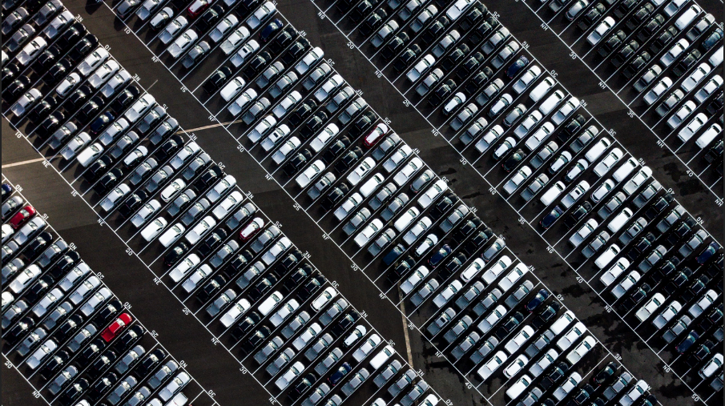

# Car Price Prediction
An anaylysis of car advertisement data from AutoTrader - required as part of Udacity Data Scientist Nanodegree.

## Table of Contents

1. [Installation](#installation)
2. [Project Motivation](#project-motivation)
3. [File Descriptions](#file-descriptions)
4. [Results](#results)
5. [Licensing and Acknowledgements](#licensing-and-acknowledgements)
6. [CRISP-DM Process](#crisp-dm-process)

## Installation
Most of the code in this project will run with the Anaconda distribution of Python version 3.*. However, two additional packages are required to run the entire code and can be installed with `pip` as follows:
- pip install cloudscraper
- pip install xgboost

## Project Motivation
For this project, I wanted to source the required data myself, so I wrote a scipt to scrape the data off AutoTrader. I was particularly interested in using the data to understand the following;
1. do cars with higher engine sizes accumulate more mileage than cars with smaller engine sizes?
2. do petrol cars accumulate more miles than diesel cars over their lifetime?
3. which features influence the price of a car the most?

## File Descriptions
The files used in this project have been grouped as follows:
1. `web_crawler.py` - contains code used to scrape the data from AutoTrader, and it returns a list for each feature considered and the target variable, Car Prices.
2. `car_price_prediction.ipynb` - contains code used to scrape AutoTrader or load previously scraped data saved as a pickle file. The notebook also contains code for cleaning, exploring, preparing and modelling the data, and results of the predictive models built from the data.
3. `autotrader_web_data` - used to store the scraped data in .pkl format.
4. `csv_data` -  used to store the .csv file of the scraped data.
4. `models` - contains all the models trained in the course of this project.

## Results
The main findings from this project can be found at the post available [here.](https://ikennasteve.medium.com/knowing-these-will-make-you-choose-the-right-car-afc65ae73d17)

## Licensing and Acknowledgements
No licenses are required to use the code in this project, so feel free to use as required. I will also like to thank UDACITY for providing feedback. 

## CRISP-DM Process
1. **Business Understanding:** Here we focus on understanding the objectives and requirements of the project from a business perspective, by defining the features to be considered for the purpose of answering the above Business questions.

2. **Data Understanding:** In this section, we perform the initial data collection and become familiar with the dataset by identifying data quality issues, and building initial insight into the data. 

3. **Data Preparation:** Then we advance to cleaning the data (checking for missing and duplicate data) and digging deeper into the data by visualizing it and identifying relationships between the features themselves and between the features and target variable - Car Prices. We also re-format the data as necessary, like converting the data types, etc. Finally we use the processed dataset to answer the first two Business questions posed at the beginning of the project.

4. **Data Modelling:** Here we split the dataset into training and test sets. Using the training set, we build a model and evaluate the performance of the model with the test set. Several algorithms are fitted to the training set and evaluated on the test set, and the model with the best result is selected as the best model for deployment.

5. **Results:** We found that the year of the car has a strong positive correlation with the car price. As expected, the newer the car, the more expensive it is likely to be, generally driven by newer technology (safety, comfort, efficiency, etc). There is a strong negative correlation between the car mileage and the cost of the car. The higher the mileage, the more likely is it prone to wear and tear, and therefore the more likely the price will be lower compared to its newer variants.
Engine size and horsepower both have positive correlation with car price. There is an upward trend that shows the higher the engine size or horsepower, the more positively they affect the car prices.
The data also shows that cars with 2, 4 or 5 doors generally are more expensive than other variants. Number of past owners have significant influence on the price of the car. The more the number of people who have owned the car in the past, the lower the car price tends to be.
We also found that there seem to be more petrol cars posted on Autotrader than diesel and hybrid cars, but diesel cars are generally more expensive than the petrol variants. However, hybrid cars seem to be most expensive.
Cars with manual Gearbox seem to dominate the market, with automotive gearbox cars more expensive than the manual variant. Cars with hatchback body type were also found to be more popular in the UK, followed by Saloons and SUVs.

    For the three questions posed at the start, we found the following:
    - cars with bigger engine sizes are more likely to accumulate higher mileage than the smaller engine variants
    - diesel-powered cars tend to accumulate more mileages than petrol-powered cars over their litetime
    - from the dataset, the most important features for predicting car prices are
      - Engine size
      - Year of car registration, i.e. the age of the car
      - Mileage completed at the point of sale
      - Engine Horsepower
      - Engine transmission type
      - Number of past owners
      - Number of doors
      - Fuel type
     
     GradientBoosting regression model was found to have the best performance of the six models built, with an R2 value of 91% and RMSE value of £1887.
       
